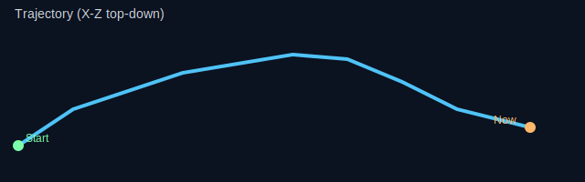
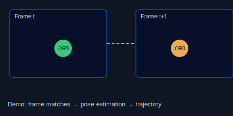
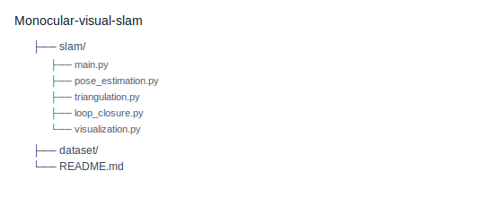
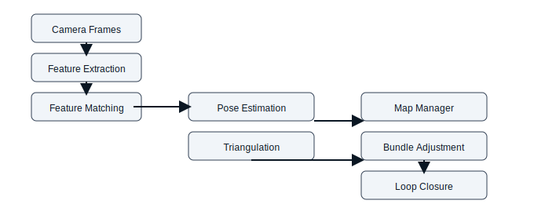

# Monocular Visual SLAM (Python)


Real-time, modular **monocular visual SLAM** pipeline in Python using ORB features, RANSAC pose estimation, triangulation, local bundle adjustment, loop-closure correction, and relocalization. The runtime now includes production-oriented controls such as structured logging, headless execution, JSON-based config overrides, artifact export, and run summaries.

> Status: production-oriented prototype. The runtime and operations story are significantly stronger now.

> Note: True production-grade SLAM still requires several engineering and validation efforts:
>
> - Benchmarking (ATE/RPE suites, performance baselining)
> - Automated regression testing and CI coverage
> - Sensor fusion for metric scale and robustness (IMU/GNSS integration)
> - Long-duration validation, memory and latency profiling
> - Packaging and deployment patterns for reproducible services

## Demo

Live demo (lightweight preview):



Example frames preview:



If you prefer raster images, replace the SVGs with `docs/demo.gif` and `docs/trajectory.png`.

## Highlights

- ORB + CLAHE feature extraction
- BFMatcher + Lowe ratio test + match deduplication
- Essential matrix (RANSAC) -> relative pose `R, t`
- Monocular scale recovery (median depth consistency)
- Keyframe-based sparse map management + pruning
- Local bundle adjustment (SciPy least-squares, sparse Jacobian)
- Loop closure detection + smooth pose-graph correction
- Lost tracking detection + PnP-based relocalization
- Camera calibration utility (checkerboard)
- Structured logging to console and file
- Headless mode for servers and batch runs
- JSON config overrides for reproducible runtime tuning
- Run artifacts: summary JSON + trajectory CSV
- Live overlay: FPS, features, matches, inliers, map points
- 2D trajectory + 3D map visualization (Open3D)

## Repository layout

This repo keeps the SLAM package under `slam/` and runtime config at the repository root:

```
slam/
  main.py
  config.py
  feature_extraction.py
  feature_matching.py
  pose_estimation.py
  triangulation.py
  map_manager.py
  keyframe_manager.py
  scale_estimator.py
  bundle_adjustment.py
  loop_closure.py
  relocalization.py
  trajectory.py
  visualization.py
  calibration.py
  kitti_loader.py
config.production.json
requirements.txt
dataset/
  dataset/
    sequences/00/... (KITTI images live here)
    poses/*.txt      (ground-truth poses)
```

Project structure (visual):



## Quick start

### 1) Install

Python **3.10+** recommended.

```bash
python -m venv .venv
# Windows (PowerShell):
.venv\Scripts\Activate.ps1
# Linux/macOS:
source .venv/bin/activate
python -m pip install -U pip
python -m pip install -r requirements.txt
```

### 2) Calibrate your camera (recommended)

Print a checkerboard and run:

```bash
python slam/calibration.py --source 0 --rows 9 --cols 6 --n 20
```

Copy the printed `CAMERA_PARAMS` into `slam/config.py`.

If you skip calibration, the pipeline will still run, but tracking quality and scale will likely degrade.

### 3) Run SLAM

Webcam:

```bash
python slam/main.py --source 0 --summary-json --save-trajectory
```

Video file:

```bash
python slam/main.py --source path/to/video.mp4
```

KITTI odometry sequence (expects an `image_0/` folder inside):

```bash
python slam/main.py --source "dataset/dataset/sequences/00" --config-file "config.production.json" --summary-json --save-trajectory
```

Controls:

- Press `q` in the OpenCV window to quit.

## CLI options

From `slam/main.py`:

- `--source`: webcam index (`0`), video path, or KITTI sequence folder
- `--scale`: resize factor applied to frames (also scales intrinsics)
- `--width`, `--height`: request webcam capture resolution
- `--no-ba`: disable bundle adjustment (faster, less accurate)
- `--no-viz`: disable 3D plotting
- `--headless`: disable all GUI windows for remote or batch execution
- `--config-file`: load JSON overrides for `CAMERA_PARAMS` / `PIPELINE_PARAMS`
- `--output-dir`: choose where logs and artifacts are written
- `--summary-json`: emit `run_summary.json`
- `--save-trajectory`: emit `trajectory_positions.csv`
- `--max-frames`: stop automatically after a bounded number of frames
- `--log-level`, `--log-file`: control observability

Examples:

```bash
# Headless batch run with artifacts
python slam/main.py --source "dataset/dataset/sequences/00" --headless --summary-json --save-trajectory --output-dir outputs/kitti_00

# Override thresholds from JSON and stop after 500 frames
python slam/main.py --source 0 --config-file "config.production.json" --max-frames 500
```

## Configuration

Edit `slam/config.py`:\

- `CAMERA_PARAMS`: `fx, fy, cx, cy` intrinsics used by pose/triangulation
- `PIPELINE_PARAMS`: thresholds (min features/matches/inliers), map caps, loop-check cadence, etc.
- `config.production.json`: example runtime override file for reproducible runs without editing source code

## Operational outputs

When you run with `--summary-json` or `--save-trajectory`, the pipeline writes:

- `slam.log`: structured runtime logs
- `run_summary.json`: frame counts, loop closures, relocalizations, FPS estimate, map statistics
- `trajectory_positions.csv`: per-frame camera positions

Default output location:

```text
outputs/latest_run/
```

## Dataset notes (KITTI)

- Use `dataset/dataset/sequences/<id>` as the `--source` (this folder contains `image_0/`).
- If `calib.txt` exists in the sequence folder, it is auto-parsed and applied at runtime.
- Ground-truth poses live in `dataset/dataset/poses/*.txt` (not consumed by the pipeline yet).

## KITTI evaluation (ATE / RPE)

A small evaluation utility is included to compute Absolute Trajectory Error (ATE) and
Relative Pose Error (RPE) against KITTI ground truth. It performs a similarity
alignment (Umeyama) to account for monocular scale ambiguity before reporting ATE.

Usage example:

```bash
python slam/kitti_evaluation.py --gt dataset/dataset/poses/00.txt --est outputs/latest_run/trajectory_positions.csv
```

The script accepts KITTI-style pose files (3x4 per line) for `--gt` and either
the `trajectory_positions.csv` produced by the pipeline (`frame_idx,x,y,z`) or
an `Nx3` positions file for `--est`.

## KITTI Evaluation

Sequence: 00  
Frames processed: 4540

| Metric | Value |
|------|------|
| ATE | 18.14 m |
| RPE (trans., delta=1) | 0.74 m/frame |


## Troubleshooting

- **Black/empty Open3D window:** try updating GPU drivers, or run with `--no-viz` to confirm the rest of the pipeline works.
-- **Imports fail:** run via `python "slam/main.py"` (so local imports resolve).
- **Poor tracking / frequent relocalization:** calibrate intrinsics, reduce motion blur, increase scene texture, or lower `--scale`.
- **Scale drift:** monocular SLAM cannot observe absolute scale without additional sensors/cues; this project uses a heuristic scale estimator.

Architecture overview:



## Production readiness

The repository is now closer to production operation because it supports:

- reproducible config management
- file-based logging
- artifact export for later analysis
- headless execution for automation and remote environments
- bounded runs via `--max-frames`

It is **still not fully production-grade SLAM** because the following are still missing:

- benchmark suite with ATE/RPE against KITTI ground truth
- automated regression tests and CI coverage
- long-duration soak testing and memory/latency profiling
- stronger loop-closure/place-recognition backends
- sensor fusion for metric scale and drift reduction
- packaging/service deployment patterns beyond direct script execution

## Acknowledgements / references

This project follows standard building blocks from classical monocular VO/SLAM literature (feature-based matching, Essential matrix pose, triangulation, bundle adjustment, loop closure).
