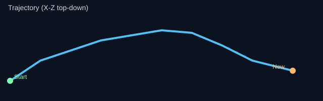
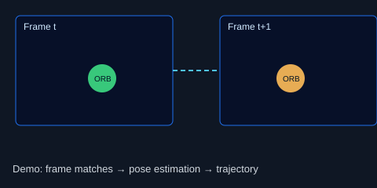
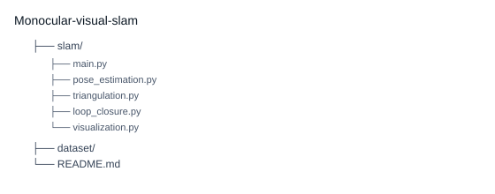
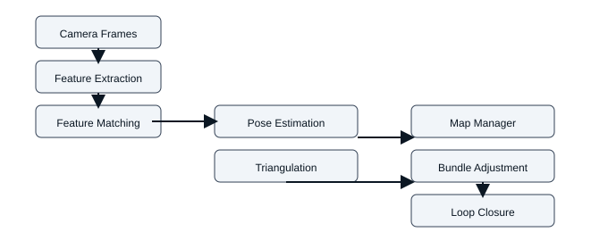

# Monocular Visual SLAM (Python)


Real-time, modular **monocular visual SLAM** pipeline in Python using ORB features, RANSAC pose estimation, triangulation, local bundle adjustment, loop-closure correction, and relocalization. The runtime now includes production-oriented controls such as structured logging, headless execution, JSON-based config overrides, artifact export, and run summaries.

> Status: research-grade prototype with corrected geometry, explicit monocular scale handling, cross-keyframe BA associations, relocalization, loop detection, automated unit tests, and reproducible evaluation tooling.

> Note: True production-grade SLAM still requires several engineering and validation efforts:
>
> - Benchmarking (ATE/RPE suites, performance baselining)
> - Automated regression testing and CI coverage
> - Sensor fusion for metric scale and robustness (IMU/GNSS integration)
> - Long-duration validation, memory and latency profiling
> - Packaging and deployment patterns for reproducible services

## Demo

Live demo (lightweight preview):



Example frames preview:



If you prefer raster images, replace the SVGs with `docs/demo.gif` and `docs/trajectory.png`.

## Highlights

- ORB + CLAHE feature extraction
- BFMatcher + Lowe ratio test + match deduplication
- Essential matrix (RANSAC) -> relative pose `R, t`
- Explicit monocular scale policy (no false metric-scale inference)
- Keyframe-based sparse map management + pruning
- Local bundle adjustment (SciPy least-squares, sparse Jacobian)
- Loop closure detection + smooth pose-graph correction
- Lost tracking detection + PnP-based relocalization
- Camera calibration utility (checkerboard)
- Structured logging to console and file
- Headless mode for servers and batch runs
- JSON config overrides for reproducible runtime tuning
- Run artifacts: summary JSON + trajectory CSV
- Live overlay: FPS, features, matches, inliers, map points
- 2D trajectory + 3D map visualization (Open3D)

## Repository layout

This repo keeps the SLAM package under `slam/` and runtime config at the repository root:

```
slam/
  main.py
  config.py
  feature_extraction.py
  feature_matching.py
  pose_estimation.py
  triangulation.py
  map_manager.py
  keyframe_manager.py
  scale_estimator.py
  bundle_adjustment.py
  loop_closure.py
  relocalization.py
  trajectory.py
  visualization.py
  calibration.py
  kitti_loader.py
config.production.json
requirements.txt
dataset/
  dataset/
    sequences/00/... (KITTI images live here)
    poses/*.txt      (ground-truth poses)
```

Project structure (visual):



## Quick start

### 1) Install

Python **3.10+** recommended.

```bash
python -m venv .venv
# Windows (PowerShell):
.venv\Scripts\Activate.ps1
# Linux/macOS:
source .venv/bin/activate
python -m pip install -U pip
python -m pip install -r requirements.txt
```

### 2) Calibrate your camera (recommended)

Print a checkerboard and run:

```bash
python slam/calibration.py --source 0 --rows 9 --cols 6 --n 20
```

The calibration tool also writes `slam/calibration_result.npz`. Use it directly at runtime:

```bash
python slam/main.py --source 0 --calibration slam/calibration_result.npz --summary-json --save-trajectory
```

The runtime undistorts frames using the measured lens distortion coefficients before feature extraction.

Copy the printed `CAMERA_PARAMS` into `slam/config.py` or provide them through a JSON config override.

If you skip calibration, the pipeline will still run, but tracking quality and scale will likely degrade.

### 3) Run SLAM

Webcam:

```bash
python slam/main.py --source 0 --summary-json --save-trajectory
```

Video file:

```bash
python slam/main.py --source path/to/video.mp4
```

KITTI odometry sequence (expects an `image_0/` folder inside):

```bash
python slam/main.py --source "dataset/dataset/sequences/00" --config-file "config.production.json" --summary-json --save-trajectory
```

Controls:

- Press `q` in the OpenCV window to quit.

## CLI options

From `slam/main.py`:

- `--source`: webcam index (`0`), video path, or KITTI sequence folder
- `--scale`: resize factor applied to frames (also scales intrinsics)
- `--width`, `--height`: request webcam capture resolution
- `--no-ba`: disable bundle adjustment (faster, less accurate)
- `--no-viz`: disable 3D plotting
- `--headless`: disable all GUI windows for remote or batch execution
- `--config-file`: load JSON overrides for `CAMERA_PARAMS` / `PIPELINE_PARAMS`
- `--calibration`: load calibrated camera intrinsics/distortion from `.npz`
- `--metrics-file`: choose the runtime health metrics JSON path
- `--output-dir`: choose where logs and artifacts are written
- `--summary-json`: emit `run_summary.json`
- `--save-trajectory`: emit `trajectory_positions.csv` and full-pose `trajectory_poses.csv`
- `--max-frames`: stop automatically after a bounded number of frames
- `--log-level`, `--log-file`: control observability

Examples:

```bash
# Headless batch run with artifacts
python slam/main.py --source "dataset/dataset/sequences/00" --headless --summary-json --save-trajectory --output-dir outputs/kitti_00

# Override thresholds from JSON and stop after 500 frames
python slam/main.py --source 0 --config-file "config.production.json" --max-frames 500
```

## Configuration

Edit `slam/config.py`:\

- `CAMERA_PARAMS`: `fx, fy, cx, cy` intrinsics used by pose/triangulation
- `PIPELINE_PARAMS`: thresholds (min features/matches/inliers), map caps, loop-check cadence, etc.
- `config.production.json`: example runtime override file for reproducible runs without editing source code

## Operational outputs

When you run with `--summary-json` or `--save-trajectory`, the pipeline writes:

- `slam.log`: structured runtime logs
- `run_summary.json`: frame counts, loop closures, relocalizations, FPS estimate, map statistics
- `runtime_metrics.json`: effective FPS, P50/P95/P99 latency, tracking success/failure rate, slow-frame rate and feature/match/inlier averages
- `trajectory_positions.csv`: per-frame camera positions
- `trajectory_poses.csv`: full camera-to-world 3x4 poses for rotation-aware evaluation

Default output location:

```text
outputs/latest_run/
```

## Dataset notes (KITTI)

- Use `dataset/dataset/sequences/<id>` as the `--source` (this folder contains `image_0/`).
- If `calib.txt` exists in the sequence folder, it is auto-parsed and applied at runtime.
- Ground-truth poses live in `dataset/dataset/poses/*.txt`; the evaluator consumes them separately so runtime code does not depend on ground truth.

## KITTI evaluation (ATE / RPE)

A small evaluation utility is included to compute Absolute Trajectory Error (ATE) and
Relative Pose Error (RPE) against KITTI ground truth. It performs a similarity
alignment (Umeyama) to account for monocular scale ambiguity before reporting ATE.

Usage example:

```bash
python slam/kitti_evaluation.py --gt dataset/dataset/poses/00.txt --est outputs/latest_run/trajectory_poses.csv
```

The script accepts KITTI-style pose files (3x4 per line) for `--gt` and either
the `trajectory_positions.csv` produced by the pipeline (`frame_idx,x,y,z`) or
an `Nx3` positions file for `--est`.

## KITTI Evaluation

Run the evaluator against a freshly generated full-pose trajectory:

```bash
python slam/main.py --source "dataset/dataset/sequences/00" --headless --save-trajectory --summary-json --output-dir outputs/kitti_00
python slam/kitti_evaluation.py --gt dataset/dataset/poses/00.txt --est outputs/kitti_00/trajectory_poses.csv
```

The evaluator reports similarity-aligned ATE plus rotation-aware RPE when the full pose CSV is supplied. The previously documented numeric result was produced before the geometry/association fixes and is intentionally no longer presented as a current benchmark.

## Troubleshooting

- **Black/empty Open3D window:** try updating GPU drivers, or run with `--no-viz` to confirm the rest of the pipeline works.
- **Imports fail:** run via `python "slam/main.py"` (so local imports resolve).
- **Poor tracking / frequent relocalization:** calibrate intrinsics, reduce motion blur, increase scene texture, or lower `--scale`.
- **Scale drift:** monocular SLAM cannot observe absolute metric scale from images alone; this project keeps an explicit internal scale of 1.0 unless an external metric cue is supplied.

Architecture overview:



## Real-world validation

A repeatable validation runner is included for a webcam or recorded video:

    python scripts/real_world_validation.py --source 0 --frames 300 --calibration slam/calibration_result.npz

# Long-duration stability gate (recorded video or webcam)
python scripts/stress_validation.py --source 0 --frames 3000 --calibration slam/calibration_result.npz

It runs headless, disables bundle adjustment for a stable latency baseline, and writes runtime metrics, a validation report, trajectories, and the normal SLAM log/summary.

The validation report checks configurable thresholds for tracking success rate, effective FPS, slow-frame rate, and P95 frame latency. These are engineering health gates, not accuracy guarantees. For metric accuracy, use a measured reference trajectory or an external sensor.

## Current limitations and validation

The core geometry and pipeline integration are implemented, but this remains a monocular research prototype rather than a safety-critical production SLAM stack.

Known limitations:

- Monocular scale is inherently unobservable from images alone; the default internal scale is arbitrary. Metric scale requires an external cue such as IMU, wheel odometry, GNSS, known baseline, or another calibrated prior.
- Loop detection uses a lightweight descriptor-similarity candidate stage plus Essential-matrix geometric verification; a BoW/learned place-recognition backend would be stronger for large environments.
- KITTI evaluation is provided as an explicit offline step; dataset downloads and large benchmark sweeps are intentionally not part of CI.
- Long-duration profiling and target-hardware real-time validation still need to be performed on target machines.

The repository now includes unit coverage for coordinate-frame conversion, triangulation alignment, landmark/observation indexing, scale-policy behavior, trajectory evaluation, and runtime latency metrics. Batch KITTI evaluation and long-duration stress validation are also provided as repeatable scripts. CI runs syntax checks, linting, evaluation CLI validation, and pytest. Real-camera validation is intentionally a hardware-dependent run rather than a CI test.

For a real deployment, validate camera calibration, lighting/motion conditions, CPU/GPU load, memory growth, tracking-loss recovery, and trajectory drift on the target camera and hardware before relying on the output for navigation.

## Acknowledgements / references

This project follows standard building blocks from classical monocular VO/SLAM literature (feature-based matching, Essential matrix pose, triangulation, bundle adjustment, loop closure).
